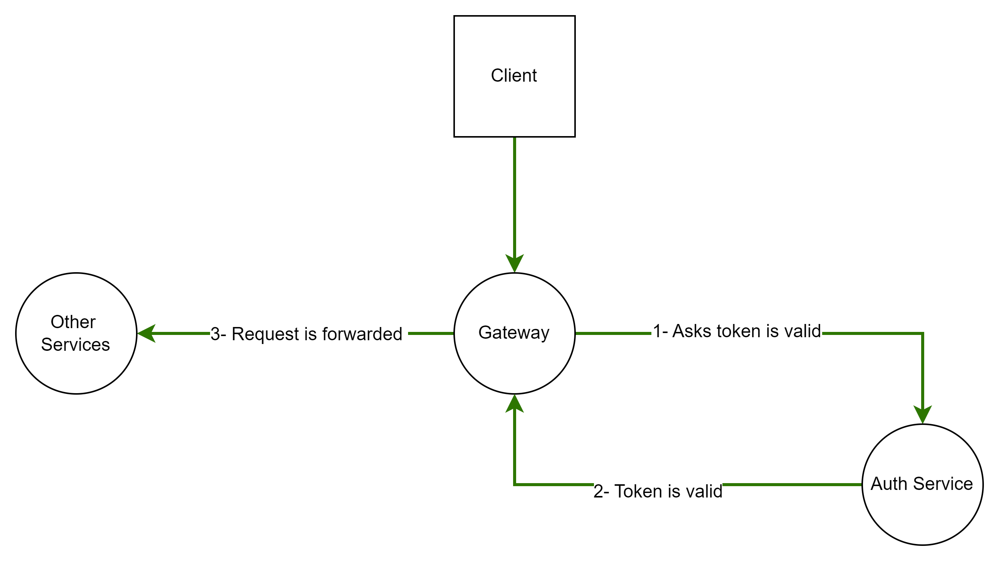
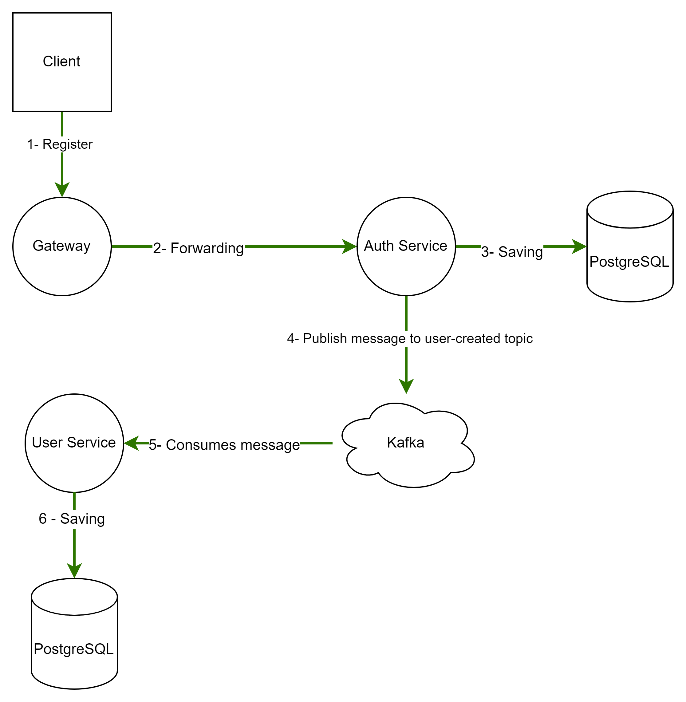

# microservice-example-with-different-technologies
 This project is a demo representation of micro-service structure focused on authentication side.
 Spring eureka is used for service-client registery.
 For request forwarding, spring cloud gateway is implemented. 
 Spring security and jwt token are used for authentication and security.

## Technologies
- Spring Boot
- Spring Cloud Eureka Server
- Spring Cloud Gateway
- Spring Security
- JWT token
- GRPC
- Kafka
- postgreSQL
- Redis
- Elasticsearch, Logstash, Kibana ( ELK structure)
- Docker

## Components
- Gateway
- Auth Service
- User Service
### Gateway
It is responsible for forwarding requests to other microservices. Also, it is the first layer of security. 
For all requests, It asks whether JWT token is valid to auth service. Communication is handled by gRPC.
For future usages, there is a plan for implementing redis cache to relieve visit frequency by request to auth service. 
According to plan, Gateway store tokens in cache for certain time, by doing that unnecessary visiting of auth service will be prevented.
### Auth Service
It is responsible currently for authentication, login management and for autherization in later stages. 
It stores user's credentials in database, postgreSQL. User register the system with this service. 
After registering successfully, auth service publishes a message to kafka on user-created topic for indicating a new user is created with the unique username.

### User Service
It stores other information, not credential ones, of users in database, postgreSQL. For example, name, surname etc. 
It is the consumer of user-created topic in kafka. 
When a new user is registered, user service stores it according to its username. Then, other information can be entered.
Username serves as communication key between these two services. Also, this service uses Redis for in memory caching 
to reduce response time and unnecessary visiting of database for some queries. Furthermore, it has a logging system by using interceptor and ELK structure.
Logstash is used to transfer logs to elasticsearch. Kibana is used to visualize the logs.

## Workflow
With docker-compose up command in directory of necessary-files, docker-compose.yml can be started. 
Then, all necessary technologies will be ready for test. After all services are up, by using test-data and postman, data transferring can be seen by connecting kafka ui, 9090 port. Also, by accesing kibana from 5601 port, data can be viewed from elasticsearch indexes.,
### Security

### User Registration
